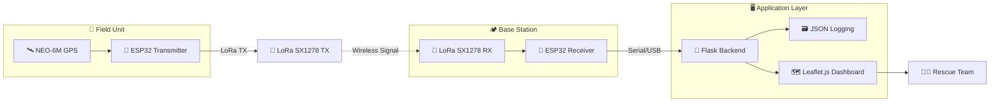
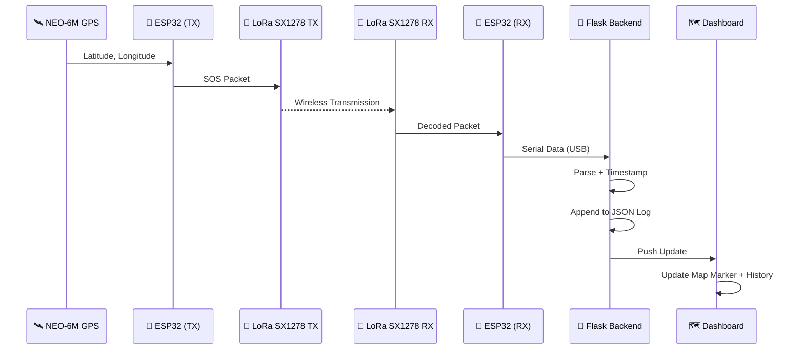

<div align="center">

# 🚨 Rescue Zero

### LoRa-Based Emergency SOS Tracking System for Disaster Rescue Operations


<br>

[](https://www.espressif.com/)
[](https://www.semtech.com/lora)
[](https://flask.palletsprojects.com/)
[](https://leafletjs.com/)
[](LICENSE)

[](https://github.com/yourusername/rescue-zero/stargazers)
[](https://github.com/yourusername/rescue-zero/network/members)
[](https://github.com/yourusername/rescue-zero/issues)
[](https://github.com/yourusername/rescue-zero/commits/main)

<br>

**📡 Saving Lives Where Cell Towers Can't Reach**

</div>

---

## 📚 Table of Contents

<details open>
<summary><b>Click to expand</b></summary>

1. [🌍 Overview](#-overview)
2. [❗ Problem Statement](#-problem-statement)
3. [🎯 Objectives](#-objectives)
4. [✨ Features](#-features)
5. [🛠️ Technology Stack](#️-technology-stack)
6. [🔌 Hardware Used](#-hardware-used)
7. [💻 Software Used](#-software-used)
8. [📁 Folder Structure](#-folder-structure)
9. [🏗️ System Architecture](#️-system-architecture)
10. [🔁 Flowchart](#-flowchart)
11. [🧩 Circuit Connections](#-circuit-connections)
12. [⚙️ Working Principle](#️-working-principle)
13. [📊 Data Flow](#-data-flow)
14. [🚀 Installation Guide](#-installation-guide)
15. [📋 Requirements](#-requirements)
16. [▶️ Running Instructions](#️-running-instructions)
17. [🖥️ Dashboard Overview](#️-dashboard-overview)
18. [📸 Screenshots Section](#-screenshots-section)
19. [🎬 Demo](#-demo)
20. [🔮 Future Improvements](#-future-improvements)
21. [👥 Contributors](#-contributors)
22. [📄 License](#-license)
23. [🙏 Acknowledgements](#-acknowledgements)
24. [📬 Contact Information](#-contact-information)
25. [🏁 Footer](#-footer)

</details>

---

## 🌍 Overview

**Rescue Zero** is an off-grid, long-range **emergency SOS tracking system** designed for disaster-hit and remote areas where **cellular and internet infrastructure is unavailable or destroyed**.

Using **LoRa (Long Range) radio communication**, the system transmits precise GPS coordinates from a victim's location to a base station receiver — without relying on any telecom network. The received data is instantly visualized on a **live interactive map dashboard**, giving rescue teams real-time visibility of SOS signals, historical alert logs, and timestamped location data.

> 🩹 *When towers fall and networks go dark, Rescue Zero keeps the signal alive.*

---

## ❗ Problem Statement

During natural disasters such as **earthquakes, floods, landslides, and cyclones**, telecom towers and internet infrastructure are often the first casualties. This leaves victims stranded with:

- 📵 No way to call for help
- 🌐 No internet connectivity
- 🛰️ No access to conventional GPS-sharing apps
- ⏳ Rescue teams operating blind, without real location data

Traditional communication systems **fail exactly when they are needed the most**. Rescue Zero addresses this critical gap by using **license-free, long-range LoRa radio** to transmit emergency location data independent of any carrier network.

---

## 🎯 Objectives

- ✅ Build a **low-cost, low-power** SOS transmission system
- ✅ Achieve **long-range communication** (up to several kilometers) without cellular/Wi-Fi
- ✅ Provide **real-time GPS tracking** of distress signals
- ✅ Visualize incoming alerts on a **live web dashboard**
- ✅ Maintain a **persistent SOS history log** for rescue coordination
- ✅ Design a system that is **field-deployable, portable, and battery-friendly**
- ✅ Keep the architecture **simple, open-source, and reproducible**

---

## ✨ Features

<div align="center">

| Feature | Description |
|---|---|
| 📡 **Long-Range LoRa Transmission** | Sends SOS + GPS data over kilometers without internet/cellular |
| 🛰️ **Live GPS Tracking** | NEO-6M module fetches accurate latitude/longitude coordinates |
| 🗺️ **Interactive Live Map** | Real-time victim location plotted using Leaflet.js |
| 🕒 **Automatic Timestamping** | Every SOS alert is logged with date & time of reception |
| 📜 **Clickable SOS History Panel** | Browse all previous alerts and jump to their map location |
| 📍 **Live Marker Updates** | Map automatically updates when new SOS signals arrive |
| 🗃️ **JSON Data Logging** | All alerts stored persistently in structured JSON format |
| 🔋 **Low Power Design** | Optimized for portable, battery-operated field units |
| 🧩 **Modular Hardware** | Transmitter & receiver units are independently deployable |
| 🌐 **Offline-First Backend** | Flask server can run fully on a local network, no cloud needed |

</div>

---

## 🛠️ Technology Stack

<div align="center">


</div>

---

## 🔌 Hardware Used

<details open>
<summary><b>📦 View Full Hardware List</b></summary>

<br>

| # | Component | Quantity | Purpose |
|---|---|---|---|
| 1 | 🧠 ESP32 Dev Board | 2 | Transmitter + Receiver microcontrollers |
| 2 | 📡 LoRa SX1278 (Ra-02) Module | 2 | Long-range wireless communication |
| 3 | 🛰️ NEO-6M GPS Module | 1 | Live GPS coordinate acquisition |
| 4 | 🔋 Li-ion Battery / Power Bank | 1–2 | Portable field power supply |
| 5 | 🧵 Jumper Wires (M-M / M-F) | Several | Circuit connections |
| 6 | 🔘 Push Button (Optional) | 1 | Manual SOS trigger |
| 7 | 💡 LED Indicators | 2 | Transmission / reception status |
| 8 | 🧰 Breadboard / PCB | 1–2 | Prototyping and mounting |
| 9 | 📶 LoRa Antenna (433/868/915 MHz) | 2 | Signal range extension |
| 10 | 💻 USB Cables | 2 | ESP32 programming & serial connection |

</details>

---

## 💻 Software Used

<details open>
<summary><b>🧰 View Full Software Stack</b></summary>

<br>

- 🔧 **Arduino IDE** — Firmware development for ESP32 (Transmitter & Receiver)
- 🐍 **Python 3.x** — Flask backend server
- 🌶️ **Flask** — REST API & Serial-to-Web data bridge
- 🌐 **HTML5 / CSS3 / JavaScript** — Dashboard front-end
- 🗺️ **Leaflet.js** — Interactive live map rendering
- 🔌 **PySerial** — Serial communication between ESP32 receiver and Flask
- 🗃️ **JSON** — Lightweight persistent SOS data storage
- 🖥️ **VS Code** — Development environment

</details>

---

## 📁 Folder Structure

```bash
Rescue-Zero/
│
├── 📂 firmware/
│   ├── transmitter/
│   │   └── transmitter.ino          # ESP32 + GPS + LoRa TX code
│   └── receiver/
│       └── receiver.ino             # ESP32 + LoRa RX code
│
├── 📂 backend/
│   ├── app.py                       # Flask main application
│   ├── serial_reader.py             # Serial communication handler
│   ├── sos_data.json                # SOS logs (auto-generated)
│   └── requirements.txt             # Python dependencies
│
├── 📂 frontend/
│   ├── templates/
│   │   └── index.html               # Dashboard HTML page
│   └── static/
│       ├── css/
│       │   └── style.css            # Dashboard styling
│       └── js/
│           └── map.js               # Leaflet.js map logic
│
├── 📜 README.md
├── 📜 LICENSE
└── 📜 .gitignore
```

---

## 🏗️ System Architecture

Rescue Zero follows a **three-tier architecture**:

1. **📡 Transmission Layer (Field Unit)** — ESP32 + NEO-6M GPS + LoRa SX1278 captures location and transmits SOS packets wirelessly.
2. **📥 Reception Layer (Base Station)** — A second ESP32 with LoRa SX1278 receives the packet and relays it via Serial (USB) to a host computer.
3. **🖥️ Application Layer (Dashboard)** — A Flask backend parses incoming serial data, logs it as JSON, and serves it to a Leaflet.js-powered web dashboard for real-time visualization.

<div align="center">



</div>

---

## 🔁 Flowchart

```
[NEO-6M GPS] → [ESP32 Transmitter] → [LoRa SX1278 TX]
        ↓ (Wireless LoRa Signal)
[LoRa SX1278 RX] → [ESP32 Receiver] → [Serial (USB)]
        ↓
[Python Flask Backend] → [JSON Logging] → [Leaflet.js Dashboard]
        ↓
[Live Map + SOS History + Timestamps]
```

---

## 🧩 Circuit Connections

<details open>
<summary><b>🔌 Pin Connection Reference</b></summary>

<br>

**Transmitter (ESP32 + NEO-6M + LoRa SX1278)**

| ESP32 Pin | Connects To |
|---|---|
| GPIO 4 (RX) | GPS TX |
| GPIO 2 (TX) | GPS RX |
| GPIO 5 | LoRa NSS |
| GPIO 18 | LoRa SCK |
| GPIO 19 | LoRa MISO |
| GPIO 23 | LoRa MOSI |
| GPIO 14 | LoRa RST |
| GPIO 26 | LoRa DIO0 |
| 3.3V / GND | Power |

**Receiver (ESP32 + LoRa SX1278)**

| ESP32 Pin | Connects To |
|---|---|
| GPIO 5 | LoRa NSS |
| GPIO 18 | LoRa SCK |
| GPIO 19 | LoRa MISO |
| GPIO 23 | LoRa MOSI |
| GPIO 14 | LoRa RST |
| GPIO 26 | LoRa DIO0 |
| USB | Serial → PC (Flask backend) |

</details>

---

## ⚙️ Working Principle

1. 🛰️ The **NEO-6M GPS module** continuously acquires latitude and longitude data at the victim's location.
2. 🧠 The **transmitter ESP32** reads and parses this GPS data using serial communication.
3. 📡 The GPS coordinates (along with an SOS flag) are packaged and transmitted through the **LoRa SX1278** module over long-range radio frequency.
4. 📥 The **receiver ESP32**, located at the base/rescue station, picks up the incoming LoRa packet.
5. 🔌 The receiver forwards the decoded data to a connected computer via **Serial (USB)** communication.
6. 🐍 The **Flask backend** listens on the serial port, parses incoming SOS packets, timestamps them, and appends them to a **JSON log file**.
7. 🗺️ The **Leaflet.js dashboard** polls/receives this data and updates the **live map marker** and **SOS history panel** in real time.
8. 🚑 Rescue teams monitor the dashboard to locate and prioritize victims for evacuation.

---

## 📊 Data Flow

<div align="center">



</div>

---

## 🚀 Installation Guide

### 1️⃣ Clone the Repository

```bash
git clone https://github.com/yourusername/rescue-zero.git
cd rescue-zero
```

### 2️⃣ Set Up the Firmware (Arduino IDE)

<details>
<summary><b>📡 Transmitter Setup</b></summary>

```bash
1. Open firmware/transmitter/transmitter.ino in Arduino IDE
2. Install required libraries:
   - LoRa by Sandeep Mistry
   - TinyGPSPlus
3. Select Board: ESP32 Dev Module
4. Select correct COM Port
5. Upload the code
```

</details>

<details>
<summary><b>📥 Receiver Setup</b></summary>

```bash
1. Open firmware/receiver/receiver.ino in Arduino IDE
2. Install required libraries:
   - LoRa by Sandeep Mistry
3. Select Board: ESP32 Dev Module
4. Select correct COM Port
5. Upload the code
```

</details>

### 3️⃣ Set Up the Backend (Python Flask)

```bash
cd backend
python -m venv venv
source venv/bin/activate     # On Windows: venv\Scripts\activate
pip install -r requirements.txt
```

---

## 📋 Requirements

<details open>
<summary><b>🐍 Python Dependencies (requirements.txt)</b></summary>

```txt
Flask>=2.3.0
pyserial>=3.5
flask-cors>=4.0.0
```

</details>

<details>
<summary><b>🔌 Arduino Libraries</b></summary>

```txt
LoRa by Sandeep Mistry
TinyGPSPlus by Mikal Hart
```

</details>

**System Requirements:**

- 🐍 Python 3.8 or higher
- 🔧 Arduino IDE 1.8+ or 2.x
- 💻 Windows / macOS / Linux
- 🔌 Available USB Serial Port
- 🌐 Modern web browser (Chrome, Firefox, Edge)

---

## ▶️ Running Instructions

```bash
# 1. Connect the Receiver ESP32 to your computer via USB

# 2. Navigate to the backend folder
cd backend

# 3. Update the serial port in serial_reader.py (e.g., COM5 or /dev/ttyUSB0)

# 4. Run the Flask application
python app.py

# 5. Open your browser and go to:
http://127.0.0.1:5000
```

<div align="center">

✅ **Dashboard is now live!** Any SOS signal received via LoRa will instantly appear on the map.

</div>

---

## 🖥️ Dashboard Overview

The Rescue Zero dashboard is a single-page web application built with **HTML, CSS, JavaScript, and Leaflet.js**, offering:

- 🗺️ A **live interactive map** centered on the most recent SOS location
- 📍 A **dynamic marker** that updates automatically as new alerts arrive
- 📜 A **clickable SOS history panel** listing every past alert with its timestamp
- 🕒 **Automatic timestamp generation** for each received signal
- 🔄 Real-time refresh with no manual reload required

---

## 📸 Screenshots Section

> 📌 Add your own dashboard and history panel screenshots here once the system is deployed and running.

| Screen | Description |
|---|---|
| 🗺️ Live Map Dashboard | Displays the current SOS location on an interactive Leaflet.js map |
| 📜 SOS History Panel | Lists all previously received alerts with timestamps, clickable to re-center the map |

---

## 🎬 Demo

> 🎥 A demo video/GIF showing an SOS signal being transmitted, received, and plotted on the dashboard in real time can be added here once recorded.

---

## 🔮 Future Improvements

- [ ] 🔋 Solar-powered field units for extended off-grid deployment
- [ ] 📲 Mobile app (Android/iOS) with push notifications for rescue teams
- [ ] 🧭 Multi-node mesh LoRa network for wider area coverage
- [ ] 🤖 AI-based victim priority scoring using signal strength & location clustering
- [ ] ☁️ Optional cloud sync for multi-station coordination
- [ ] 🔐 End-to-end encrypted LoRa packet transmission
- [ ] 🔊 Buzzer/vibration feedback confirming SOS transmission
- [ ] 🗣️ Voice message capability over LoRa (compressed audio)
- [ ] 🛰️ Integration with satellite communication as a fallback layer
- [ ] 📈 Analytics dashboard for disaster response coordination teams

---

## 👥 Contributors

<div align="center">

Rescue Zero was designed and developed by:

| Name | Role |
|---|---|
| 🧑‍💻 **Sivaarunmani G K** | Developer & Contributor |
| 🧑‍💻 **Vishal S** | Developer & Contributor |
| 👩‍💻 **Haritha K** | Developer & Contributor |

Want to contribute? Check out our [Contributing Guidelines](CONTRIBUTING.md) and submit a Pull Request! 🚀

</div>

---

## 📄 License

<div align="center">

This project is licensed under the **MIT License** — see the [LICENSE](LICENSE) file for details.

[](LICENSE)

</div>

---

## 🙏 Acknowledgements

- 📡 [Sandeep Mistry's Arduino LoRa Library](https://github.com/sandeepmistry/arduino-LoRa)
- 🛰️ [TinyGPSPlus by Mikal Hart](https://github.com/mikalhart/TinyGPSPlus)
- 🗺️ [Leaflet.js](https://leafletjs.com/) — for the beautiful open-source mapping library
- 🌶️ [Flask](https://flask.palletsprojects.com/) — for the lightweight and powerful backend framework
- 🧠 [Espressif Systems](https://www.espressif.com/) — for the ESP32 platform
- 🌍 OpenStreetMap contributors for map tile data
- 💙 All open-source contributors who make disaster-tech accessible to everyone

---

## 📬 Contact Information

<div align="center">

**Project Team:** Sivaarunmani G K · Vishal S · Haritha K

[](mailto:youremail@example.com)
[](https://linkedin.com/in/yourusername)
[](https://github.com/yourusername)

Have a question, suggestion, or want to collaborate on disaster-tech? Reach out anytime! 💬

</div>

---

## 🏁 Footer

<div align="center">

### ⭐ If Rescue Zero inspired you, consider giving it a star!


<br><br>

**Made with ❤️, ESP32s, and a mission to help when it matters most.**

<br>

🚨 **Rescue Zero** — *Because signals should never go silent.* 🚨

<br>

By **Sivaarunmani G K**, **Vishal S**, and **Haritha K**

</div>
